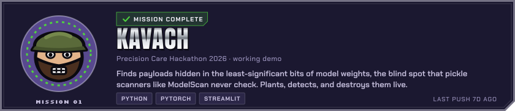
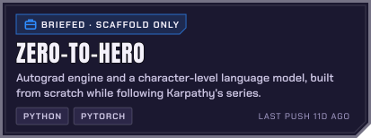
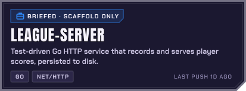
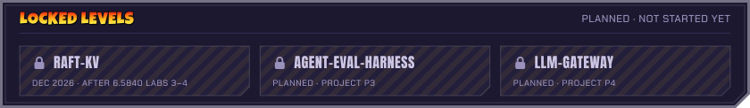

<!--
  This profile is generated. To change it, edit config.json and push:
  the refresh-profile workflow re-renders every panel from live data and
  rewrites only the block between the mm:start and mm:end markers.
  Local preview with synthetic data: python scripts/build.py --fixture --out /tmp/preview
-->
<!-- mm:start -->

  
  
  
  
  

  
  

<b>Text version</b> · every number above, as a table

| Stat | Value |
|---|---|
| Commits (public, all-time) | 161 |
| Contributions (last 12 months) | 184 |
| Active days (last 12 months) | 49 |
| Current streak | 0 days |
| Best streak (all-time) | 4 days |
| Pull requests opened | 11 |
| Public repos (forks excluded) | 25 |
| Stars on own repos | 7 |
| Rank | Corporal (205 XP = all-time contributions) |
| Top languages (share of bytes, excluding HTML/CSS/SCSS) | TypeScript 36.2%, JavaScript 26.3%, Dart 21.4%, Python 10.9%, PLpgSQL 2.4% |
| Last sync | 2026-09-30 15:08 IST |

<!-- mm:end -->
